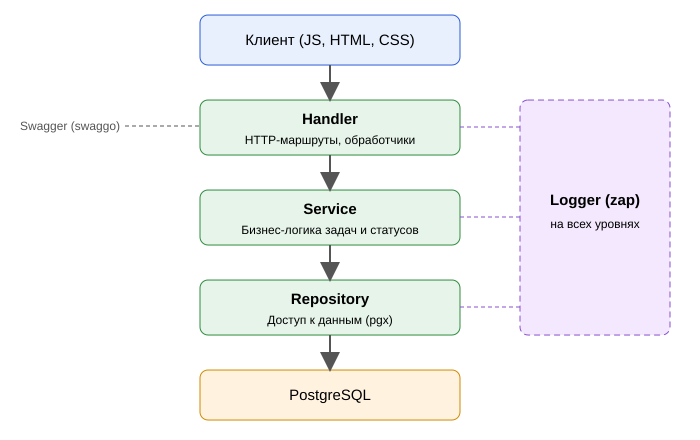

# Архитектура

**Разделы:** [Главная](../index.md) | Пользователю: [Быстрый старт](../user/quick-start.md) · [Руководство](../user/user-guide.md) · [FAQ](../user/faq.md) | Разработчику: [Установка](../developer/installation.md) · [Архитектура](../developer/architecture.md) · [API](../developer/api-reference.md)

Раздел объясняет, из чего состоит приложение и в каком порядке его компоненты проверяются при внедрении.

## Состав продукта

| Часть | Технологии |
|---|---|
| Клиентская часть | JavaScript, HTML, CSS |
| Серверная часть | Go (только стандартная библиотека для HTTP) |
| База данных | PostgreSQL |
| Развёртывание | Docker, Docker Compose |
| Версионирование | Git |

## Трёхслойная архитектура



| Слой | Ответственность |
|---|---|
| **Handler** | HTTP-обработчики и маршруты, разбор запросов и формирование ответов |
| **Service** | Бизнес-логика: создание, получение, изменение, удаление задач, управление статусами, дата закрытия |
| **Repository** | Доступ к данным: подключение к PostgreSQL, SQL-операции с пользователями и задачами |
| **Logger** | `zap`; фиксирует операции и ошибки на всех уровнях |

Запрос идёт сверху вниз: Handler → Service → Repository → БД.

## Порядок внедрения и проверки

Компоненты связаны между собой, поэтому внедряются и проверяются снизу вверх:

1. **Repository** и база данных;
2. **Service** — бизнес-логика;
3. **Handler** — API и взаимодействие с пользователем.

Каждый слой проверяйте до перехода к следующему. Тесты запускаются командой:

```bash
go test ./...
```

Команда выполняет автотесты проекта; все тесты должны проходить без ошибок. Затем переходите к [справочнику API](api-reference.md).
