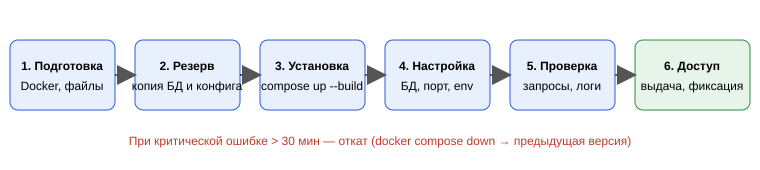

# Установка и настройка

**Разделы:** [Главная](../index.md) | Пользователю: [Быстрый старт](../user/quick-start.md) · [Руководство](../user/user-guide.md) · [FAQ](../user/faq.md) | Разработчику: [Установка](../developer/installation.md) · [Архитектура](../developer/architecture.md) · [API](../developer/api-reference.md) · [Эксплуатация](../developer/operations.md)

Раздел отвечает на вопросы: что нужно для запуска, как установить приложение и как его настроить. Для понимания устройства системы см. [архитектуру](architecture.md).

## Системные требования

| Параметр | Требование |
|---|---|
| Операционная система | Linux |
| Процессор | Intel Core i3 и выше |
| Оперативная память | 6 ГБ |
| Свободное место | 10 ГБ |
| Сеть | доступ к серверу по локальной сети |
| Программы | Docker, Docker Compose, Git |

Для разработки без Docker дополнительно: Go 1.27.1 и PostgreSQL 18. Используемые библиотеки: `zap` (логирование), `swaggo` (Swagger), `pgx` (драйвер PostgreSQL), `envconfig` (конфигурация из переменных окружения).

## Установка

1. Проверьте наличие Docker и Docker Compose:

   ```bash
   docker --version
   docker compose version
   ```

2. Получите исходные файлы проекта (с `Dockerfile` и `docker-compose.yml`):

   ```bash
   git clone <адрес-репозитория> todo-api
   cd todo-api
   ```

3. Перед обновлением существующей версии сделайте [резервную копию](operations.md#резервное-копирование).
4. Соберите и запустите контейнеры:

   ```bash
   docker compose up -d --build
   ```

5. Проверьте, что контейнеры работают:

   ```bash
   docker compose ps
   ```

**Результат:** запущены контейнеры приложения и PostgreSQL, API доступен на порту 8080.
Команда `--build` пересобирает образы, `-d` запускает контейнеры в фоне. Используйте её при первой установке и после изменения кода.



## Настройка

Параметры подключения к БД, порт API и переменные окружения задаются в `docker-compose.yml` и файле конфигурации. Читаются библиотекой `envconfig`.

| Переменная | Назначение | Пример |
|---|---|---|
| `APP_PORT` | Порт API | `8080` |
| `DB_HOST` | Адрес PostgreSQL | `db` |
| `DB_PORT` | Порт PostgreSQL | `5432` |
| `DB_USER` | Пользователь БД | `todo` |
| `DB_PASSWORD` | Пароль БД | задаётся администратором |
| `DB_NAME` | Имя базы данных | `todo` |

> **Важно:** точные имена переменных сверьте с вашим `docker-compose.yml` и структурой конфигурации в коде.

## Проверка установки

```bash
curl http://localhost:8080/tasks
```

Ожидается ответ с кодом 200 и списком задач (возможно, пустым). Затем создайте, получите, измените и удалите тестовую задачу — примеры в [справочнике API](api-reference.md). Если контейнеры не стартуют — [диагностика](operations.md#диагностика).

## Ограничения

- приложение рассчитано на небольшую группу пользователей (пилотное внедрение);
- аутентификация не описана — доступ ограничивается сетью;
- версии зависимостей зафиксируйте перед обновлением.
